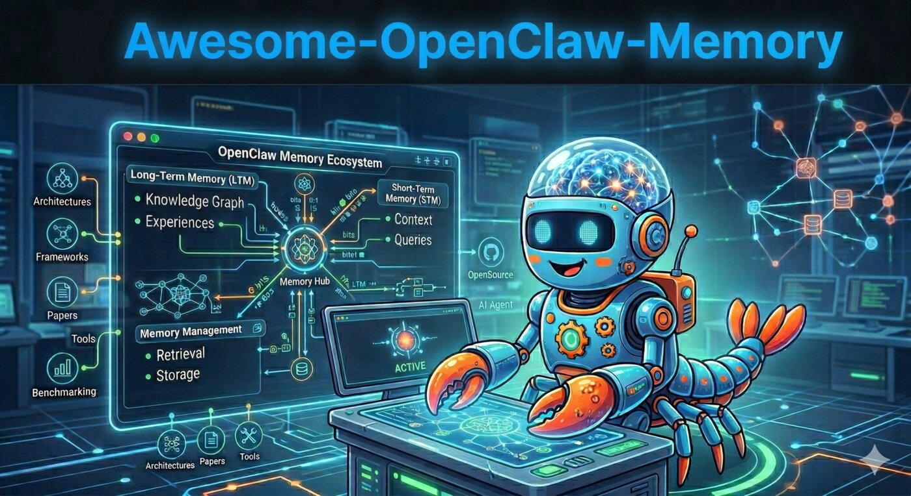

# Awesome-OpenClaw-Memory

<p align="center">
    【English | <a href="README_cn.md">中文</a>】
</p>

<div align="center">
    
</div>

[](https://github.com/sologuy/Awesome-OpenClaw-Memory)
[](https://opensource.org/licenses/MIT)

[](#-openclaw-related-papers)
[](#-systems-and-open-sources)
[](#-openclaw-memory-plugins)


## 👋 Introduction

[OpenClaw](https://github.com/OpenClaw/OpenClaw) is an open-source autonomous AI virtual assistant originally developed by Austrian software engineer Peter Steinberger. First released on GitHub as "Clawdbot" in November 2025, later renamed to "Moltbot" and finally "OpenClaw" in January 2026, the project has since grown to over 200K GitHub stars and sparked a global wave of adoption. OpenClaw can be deployed locally on macOS/Windows, calls various AI models and APIs, and receives user instructions via WhatsApp, Telegram, Signal, Discord and other messaging platforms to autonomously handle tasks like scheduling, messaging, file management, and coding.

A key differentiator of OpenClaw is its **persistent memory** — it stores configuration data and interaction history locally, enabling cross-session continuity. However, the design, security, and scalability of this memory system remain an active frontier for the community.

**Awesome-OpenClaw-Memory** is a curated collection dedicated to memory systems, architectures, and best practices within the OpenClaw ecosystem. This repository gathers research papers, open-source memory frameworks, and practical implementations relevant to enhancing OpenClaw's memory capabilities.

Whether you're extending OpenClaw's built-in local memory, integrating external frameworks like Mem0 or Zep, or researching agent memory security (e.g., memory poisoning attacks) — this is your one-stop resource.

---

## 🎯 Goal of Repository

Our mission is to build the most comprehensive knowledge base for OpenClaw memory systems, serving both researchers exploring agent memory frontiers and practitioners deploying memory-enhanced OpenClaw agents in production. We aim to accelerate the development of OpenClaw's persistent memory capabilities — from local interaction history to scalable, secure, cross-session knowledge management.

---

## 📏 Project Scope

This repository focuses on memory mechanisms and system designs that extend or augment OpenClaw's cognitive capabilities, encompassing both theoretical research and engineering practices.

🌀 Included Content (In Scope)
- Memory architecture designs for OpenClaw agents
- OpenClaw-specific memory skills and plugins
- External memory frameworks integrable with OpenClaw (Mem0, Zep, Letta, LangMem, etc.)
- Memory management strategies (writing, retrieval, updating, forgetting, compression)
- Memory security (memory poisoning, integrity checks, sandboxing)
- Multi-agent shared memory in OpenClaw workflows
- Benchmarks and evaluation methods for agent memory
- Best practices and production patterns

🌀 Excluded Content (Out of Scope)
- General LLM pre-training research without agent memory relevance
- Traditional databases or retrieval systems unrelated to AI agents
- Non-agent memory systems without transfer value to OpenClaw

---

## 🔔 Recent Updates
+ 2026-03-22 - 🎉 Added OpenViking (17K+ stars, ByteDance/Volcengine context database for AI Agents)
+ 2026-03-22 - 🎉 Added mem9 (ContextEngine-native persistent memory by PingCAP/TiDB founder)
+ 2026-03-21 - 🎉 Added 5 OpenClaw memory plugins (memory-lancedb-pro, openclaw-supermemory, MemOS-Cloud, graph-memory, openclaw-memory-mem0)
+ 2026-03-21 - 🎉 Initial release with 2 OpenClaw papers, 22 open-source memory systems, and the Adam Framework

---

## 🗺️ Table of Contents
- [Introduction](#-introduction)
- [Goal of Repository](#-goal-of-repository)
- [Project Scope](#-project-scope)
- [Recent Updates](#-recent-updates)
- [Core Concepts](#-core-concepts)
- [OpenClaw Related Papers](#-openclaw-related-papers)
- [Resource](#-resource)
  - [Systems and Open Sources](#-systems-and-open-sources)
  - [OpenClaw Memory Plugins](#-openclaw-memory-plugins)
  - [OpenClaw Memory Frameworks](#-openclaw-memory-frameworks)
- [Make a Contribution](#-make-a-contribution)
- [Star Trends](#-star-trends)

---

## 🧠 Core Concepts

- **OpenClaw's Built-in Memory**: OpenClaw stores configuration data and interaction history locally on the user's device, providing persistent memory across sessions. This local-first design ensures privacy but introduces challenges in scalability, retrieval accuracy, and memory management as interaction history grows.

- **Memory Layers**:
  - **Session Memory**: The active context during a single conversation session, including current task state and intermediate reasoning.
  - **Interaction History**: Locally stored records of past conversations and task executions across messaging platforms (WhatsApp, Telegram, Signal, Discord), forming OpenClaw's native long-term memory.
  - **Configuration Memory**: Persistent user preferences, API credentials, skill configurations, and behavioral settings.

- **Memory Challenges for OpenClaw**:
  - **Scalability**: As interaction history accumulates over months of use, efficient retrieval becomes critical.
  - **Cross-platform Consistency**: Maintaining coherent memory across multiple messaging platforms.
  - **Memory Security**: Autonomous agents face threats like memory poisoning (injecting malicious persistent data via crafted messages), intent drift (memory-induced behavioral changes), and privacy leakage — as highlighted in the "Taming OpenClaw" paper.
  - **Memory Enhancement**: Integrating external memory frameworks (Mem0, Zep, Letta, etc.) to augment OpenClaw's native local storage with vector search, knowledge graphs, and semantic retrieval.

---

## 📄 OpenClaw Related Papers

<table style="width: 100%; border-collapse: collapse;">
  <thead>
    <tr>
      <th style="width: 15%;">Date</th>
      <th style="width: 55%;">Title</th>
      <th style="width: 15%;">Tags</th>
      <th style="width: 15%;">Link</th>
    </tr>
  </thead>
  <tbody>
    <tr>
      <td rowspan="2" style="width: 15%;">2026-03-11</td>
      <td style="width: 55%;"><strong>Taming OpenClaw: Security Analysis and Mitigation of Autonomous LLM Agent Threats</strong></td>
      <td style="width: 15%;">
        
        
      </td>
      <td style="width: 15%;"><a href="https://arxiv.org/pdf/2603.11619v1">
        
      </a></td>
    </tr>
    <tr>
      <td colspan="3">
        • The paper systematically analyzes the security threats faced by autonomous large language model agents such as OpenClaw across five lifecycle stages: initialization, input, reasoning, decision-making, and execution.<br>
        • A detailed case study on OpenClaw demonstrates the destructiveness of these threats. For example, an attacker can turn transient malicious inputs into long-term behavioral control through "memory poisoning"; and during the decision-making and execution stages, ambiguous instructions may trigger "intent drift," causing the agent to escalate a simple safety-check task into destructive firewall modifications and high-risk command execution.<br>
        • Mitigation strategies include: plugin verification and signing in the initialization phase; semantic firewall isolation in the input phase; dynamic memory integrity checks and state rollback in the reasoning phase; intent consistency verification in the decision-making phase; and kernel-level sandboxing and least-privilege control in the execution phase.
      </td>
    </tr>
    <tr>
      <td rowspan="2" style="width: 15%;">2026-03-11</td>
      <td style="width: 55%;"><strong>When OpenClaw Meets Hospital: Toward an Agentic Operating System for Dynamic Clinical Workflows</strong></td>
      <td style="width: 15%;">
        
        
        
      </td>
      <td style="width: 15%;"><a href="https://arxiv.org/pdf/2603.11721">
        
      </a></td>
    </tr>
    <tr>
      <td colspan="3">
        • Constrains agents to an isolated environment where they are only allowed to read and write specific files and invoke a pre-vetted "medical skill library," cutting off arbitrary code execution and network access at the operating-system level to ensure data security and compliance.<br>
        • Instead of traditional vector retrieval, clinical documents are organized into a tree structure augmented with manifests. Relying on natural language understanding to read these manifests, the agents perform "progressive disclosure" navigation, thereby acquiring long-term medical record context in a precise and interpretable manner.<br>
        • Instead of communicating directly, multiple agents collaborate implicitly by append-only writes to shared clinical documents and event subscriptions. This allows the agents to perform on-the-fly task orchestration and flexibly handle complex, long-tail clinical needs that traditional systems cannot address.
      </td>
    </tr>
  </tbody>
</table>

---

## 📦 Resource

### 💻 Systems and Open Sources

Systems below are ordered by **publication date**:

| System      | Time       | Stars | GitHub & Website |
|-------------|------------|-------|------------------|
| Zep         | 2023-05-19 |  | https://github.com/getzep/zep<br>https://www.getzep.com/ |
| Agentmemory | 2023-07-07 |  | https://github.com/elizaOS/agentmemory<br>No official website |
| Cognee      | 2023-10-09 |  | https://github.com/topoteretes/cognee<br>https://www.cognee.ai/ |
| Letta       | 2023-10-26 |  | https://github.com/letta-ai/letta<br>https://www.letta.com/ |
| Supermemory | 2024-02-22 |  | https://github.com/supermemoryai/supermemory<br>https://supermemory.ai/ |
| Memary      | 2024-04-26 |  | https://github.com/kingjulio8238/Memary<br>No official website |
| Second-Me   | 2024-06-26 |  | https://github.com/mindverse/Second-Me<br>https://home.second.me/ |
| Mem0        | 2024-07-11 |  | https://github.com/mem0ai/mem0<br>https://mem0.ai/ |
| Memobase    | 2024-10-05 |  | https://github.com/memodb-io/memobase<br>https://www.memobase.io/ |
| LangMem     | 2025-01-22 |  | https://github.com/langchain-ai/langmem<br>https://langchain-ai.github.io/langmem/ |
| A-Mem       | 2025-02-17 |  | https://github.com/agiresearch/A-mem<br>No official website |
| Mirix       | 2025-04-16 |  | https://github.com/Mirix-AI/MIRIX<br>https://mirix.io/ |
| MemEngine   | 2025-05-04 |  | https://github.com/nuster1128/MemEngine<br>No official website |
| MemOS       | 2025-05-28 |  | https://github.com/MemTensor/MemOS<br>https://memos.openmem.net/ |
| MemoryOS    | 2025-05-30 |  | https://github.com/BAI-LAB/MemoryOS<br>https://baijia.online/memoryos/ |
| ReMe        | 2025-06-05 |  | https://github.com/agentscope-ai/ReMe<br>https://reme.agentscope.io/ |
| Nemori      | 2025-06-30 |  | https://github.com/nemori-ai/nemori<br>No official website |
| Memori      | 2025-07-24 |  | https://github.com/MemoriLabs/Memori<br>https://memorilabs.ai/ |
| MemU        | 2025-08-09 |  | https://github.com/NevaMind-AI/memU<br>https://memu.pro/ |
| SuperLocalMemory | 2026-03-01 |  | https://github.com/qualixar/superlocalmemory<br>https://superlocalmemory.com/ |
| MemMachine  | 2025-08-16 |  | https://github.com/MemMachine/MemMachine<br>https://memmachine.ai/ |
| MineContext | 2025-09-30 |  | https://github.com/volcengine/MineContext<br>No official website |
| EverMemOS   | 2025-10-29 |  | https://github.com/EverMind-AI/EverMemOS<br>https://evermind.ai/ |
| MemoryBear  | 2025-12-17 |  | https://github.com/SuanmoSuanyangTechnology/MemoryBear<br>https://www.memorybear.ai/ |

### 🔌 OpenClaw Memory Plugins

Plugins below are purpose-built for the OpenClaw ecosystem, ordered by **star count**:

| Plugin | Stars | Description | Tech |
|--------|-------|-------------|------|
| [OpenViking](https://github.com/volcengine/OpenViking) |  | Open-source context database for AI Agents by ByteDance/Volcengine — file system paradigm with L0/L1/L2 hierarchical context delivery, VikingDB vector search, self-evolving skills | Python |
| [memory-lancedb-pro](https://github.com/CortexReach/memory-lancedb-pro) |  | Production-grade LanceDB hybrid retrieval memory — Vector + BM25 search, Cross-Encoder rerank, multi-scope isolation, management CLI | TypeScript |
| [openclaw-supermemory](https://github.com/supermemoryai/openclaw-supermemory) |  | Supermemory cloud-based auto-recall memory — long-term memory and recall for OpenClaw agents | TypeScript |
| [mem9](https://github.com/mem9-ai/mem9) |  | Persistent cloud memory powered by TiDB — ContextEngine lifecycle hooks, per-agent data isolation ("one claw one database"), Memory Space visualization. By Edward Huang (PingCAP/TiDB co-founder) | TypeScript, Go |
| [MemOS-Cloud-OpenClaw-Plugin](https://github.com/MemTensor/MemOS-Cloud-OpenClaw-Plugin) |  | Official MemOS Cloud plugin — lifecycle memory with context recall before execution and conversation save after each run | JavaScript |
| [graph-memory](https://github.com/adoresever/graph-memory) |  | Knowledge graph context engine — extracts structured triples, compresses context 75%, enables cross-session experience reuse | TypeScript |
| [openclaw-memory-mem0](https://github.com/serenichron/openclaw-memory-mem0) |  | Self-hosted Mem0 REST API integration — semantic extraction memory for OpenClaw | TypeScript |

### 🧠 OpenClaw Memory Frameworks

#### OpenViking

- **Description:** Open-source context database for AI Agents by ByteDance/Volcengine (火山引擎). Designed specifically for OpenClaw and similar agents, with 17K+ GitHub stars.
- **Key Features:**
  - **File System Paradigm**: Manages agent context (memory, resources, skills) through a unified file system metaphor — hierarchical, browsable, and debuggable.
  - **L0/L1/L2 Three-Layer Loading**: L0 (always loaded core context), L1 (on-demand directory-level context), L2 (deep retrieval from VikingDB vector search) — progressive disclosure instead of monolithic injection.
  - **Self-Evolving Skills**: Automatically distills reusable skills from accumulated memory and interaction patterns.
  - **Visual Memory Traces**: Directory-recursive retrieval turns memory from black-box to white-box.
- **Backend**: VikingDB (ByteDance vector database), requires Volcengine account
- **Links:** [GitHub](https://github.com/volcengine/OpenViking) | [Website](https://www.openviking.ai/docs)

#### mem9

- **Description:** Persistent cloud memory for OpenClaw agents, powered by TiDB Cloud. Founded by Edward Huang (黄东旭), co-founder of PingCAP/TiDB. The first OpenClaw memory plugin to integrate with the **ContextEngine** lifecycle API (OpenClaw 3.7+).
- **Key Features:**
  - **ContextEngine Hooks**: `before_prompt_build` (inject memories before each LLM call), `before_reset` (save session summary), `agent_end` (capture final response) — participates in the full memory lifecycle, not just post-hoc recall.
  - **"One Claw One Database"**: Per-agent isolated storage with independent encryption and keys, not row-level tenant isolation.
  - **Memory Space**: Web-based visualization of all persisted memories at mem9.ai — transparent, inspectable memory.
  - **Multi-Agent Support**: Claude Code, OpenCode, and OpenClaw share the same memory pool via stateless plugins + cloud server.
  - **Self-Hostable**: Deploy mnemo-server with your own TiDB/MySQL instance for full data sovereignty.
- **Tools**: `memory_store`, `memory_search`, `memory_get`, `memory_update`, `memory_delete`
- **Install**: Tell your OpenClaw: `请阅读 https://mem9.ai/SKILL.md 并按照说明安装和配置 mem9`
- **Links:** [GitHub](https://github.com/mem9-ai/mem9) | [Website](https://mem9.ai)

#### Adam Framework

- **Description:** 5-layer persistent memory and coherence architecture for local AI assistants built on OpenClaw. Solves AI amnesia (cross-session) and within-session coherence degradation.
- **Layers:** Vault injection, mid-session memory search, neural graph (7219+ neurons), nightly Gemini reconciliation, coherence monitor with scratchpad dropout detection.
- **Validated:** 353 sessions, 6619 message turns, 8 months production use on a live business by a non-developer.
- **Platform:** Windows/macOS/Linux, OpenClaw, local-first, model-agnostic.
- **Links:** [GitHub](https://github.com/strangeadvancedmarketing/Adam) | [Live Demo](https://strangeadvancedmarketing.github.io/Adam/) | [Interactive Proof](https://strangeadvancedmarketing.github.io/Adam/showcase/ai-amnesia-solved.html)

---

## 🤝 Make a Contribution

We welcome contributions from the community! Please submit issues or pull requests.

**Issue Template:**
```
Title: [Paper/Project Title]
Type: [Paper / Framework / Skill / Best Practice]
Published: [arXiv / Conference / GitHub]
Summary:
  - Innovation:
  - Relevance to OpenClaw:
  - Significant Result:
```

**Pull Request Guidelines:**
- Add new entries to the appropriate section
- Include a brief description for each entry
- Ensure links are valid and accessible
- Follow the existing format and style

---

## ⭐ Star Trends

<a href="https://star-history.com/#sologuy/Awesome-OpenClaw-Memory&Date">
 <picture>
   <source media="(prefers-color-scheme: dark)" srcset="https://api.star-history.com/svg?repos=sologuy/Awesome-OpenClaw-Memory&type=Date&theme=dark" />
   <source media="(prefers-color-scheme: light)" srcset="https://api.star-history.com/svg?repos=sologuy/Awesome-OpenClaw-Memory&type=Date" />
   
 </picture>
</a>

---

## 📜 License

This project is licensed under the [MIT License](LICENSE).

---

<p align="center">
  🦞 Built with ❤️ for the OpenClaw community
</p>
